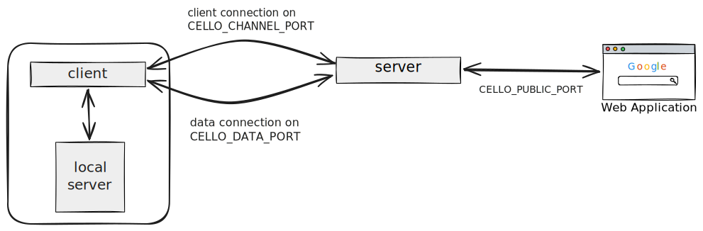

<h2 align="center">
    cello
</h2>


<p align="center">
    A lightweight reverse proxy that exposes local services to the public internet.
</p>
<p align="center">
    <a href="https://github.com/henockt/cello/blob/main/LICENSE">
        </a>
</p>

## How it works

cello uses three ports:

| Port | Default | Purpose |
|------|---------|---------|
| Channel | `9000` | Client registration |
| Public | `3001` | Incoming HTTP requests (subdomain-routed) |
| Data | `9001` | Bidirectional data transfer |

A client registers with a name (e.g. `myapp`). Requests to `myapp.<host>` on the public port are forwarded to the client, which proxies them to a local service. The server returns `504` if the client does not claim a request within 30 seconds.



## Quick start

```bash
git clone https://github.com/henockt/cello.git
cd cello
go mod download
```

```bash
# Terminal 1 – server
go run cmd/server/main.go

# Terminal 2 – local service to expose
go run cmd/test/main.go

# Terminal 3 – client
go run cmd/client/main.go -name myapp -port 3000

# Terminal 4 – test
curl http://localhost:3001 -H "Host: myapp.localhost"
# → hello, from local server
```

## Options

**Server**

| Flag | Env var | Default | Description |
|------|---------|---------|-------------|
| `-channel-port` | `CELLO_CHANNEL_PORT` | `9000` | Client registration port |
| `-public-port` | `CELLO_PUBLIC_PORT` | `3001` | Public HTTP port |
| `-data-port` | `CELLO_DATA_PORT` | `9001` | Data transfer port |
| `-default-channel` | `CELLO_DEFAULT_CHANNEL` | `myapp` | Fallback channel name for localhost/dev environments |

**Client**

| Flag | Env var | Default | Description |
|------|---------|---------|-------------|
| `-name` | `CELLO_DEFAULT_CHANNEL` | `myapp` | Channel name (used as subdomain) |
| `-port` | — | `3000` | Local service port |
| `-server` | `CELLO_SERVER_HOST` | `localhost` | cello server hostname or IP |
| `-channel-port` | `CELLO_CHANNEL_PORT` | `9000` | Server channel port |
| `-data-port` | `CELLO_DATA_PORT` | `9001` | Server data port |


## License

MIT
