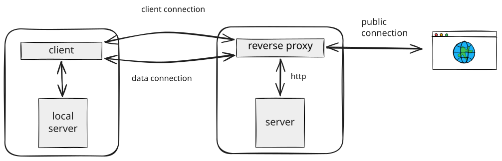

<h2 align="center">
    cello
</h2>


<p align="center">
    A lightweight reverse proxy that exposes local services to the public internet.
</p>
<p align="center">
    <a href="https://github.com/henockt/cello/blob/main/LICENSE">
        </a>
</p>

## How it works

cello serves everything on one port:

| Traffic | Reaches | Purpose |
|---------|---------|---------|
| Visitors | `myapp.<host>/…` | Incoming HTTP requests, routed by subdomain |
| Tunnel client | `<host>/_cello/channel` | Registration and request notifications |
| Tunnel client | `<host>/_cello/data` | One connection per request, for the payload |

Client connections are ordinary HTTP requests that upgrade to cello's protocol,
so a reverse proxy in front provides TLS for tunnel clients as well as for
visitors and clients only ever need to reach port 443. Control requests address the server's own host, while tunnel traffic addresses a subdomain, so they can never be confused for one another.

The server assigns each client a random channel name and replies with the full tunnel URL, e.g. `https://k7m2xq.cello.example.com`. Requests to that subdomain on the public port are forwarded to the client, which proxies them to a local service. The server returns `504` if the client does not claim a request within 30 seconds.

Run the server with `-allow-client-names` to let clients choose their own name instead.



## Quick start

```bash
git clone https://github.com/henockt/cello.git
cd cello
go mod download
```

```bash
# Terminal 1 – server (-allow-client-names keeps the URL predictable for this demo)
go run cmd/server/main.go -allow-client-names

# Terminal 2 – local service to expose
go run cmd/test/main.go

# Terminal 3 – client
go run cmd/client/main.go -server localhost -server-port 3001 -tls=false -name myapp -port 3000
#  Tunnel live: http://myapp.localhost:3001 -> localhost:3000

# Terminal 4 – test
curl http://myapp.localhost:3001
#  hello, from local server
```

Without `-allow-client-names` the server assigns the name, and the client prints
the URL to use.

`*.localhost` resolves to loopback in browsers, and on most Linux systems for
other clients too. Where it does not, address the server directly and set the
name in the `Host` header instead:

```bash
curl http://localhost:3001 -H "Host: myapp.localhost"
```

## Options

**Server**

| Flag | Env var | Default | Description |
|------|---------|---------|-------------|
| `-listen` | `CELLO_LISTEN` | `:3001` | Address to listen on; use `127.0.0.1:3001` behind a proxy |
| `-public-base` | `CELLO_PUBLIC_BASE` | `http://localhost:3001` | Base URL tunnels are published under |
| `-allow-client-names` | `CELLO_ALLOW_CLIENT_NAMES` | `false` | Let clients choose their own channel name |
| `-reserved-names` | `CELLO_RESERVED_NAMES` | `www,api,admin,mail` | Names that may never be registered |

`-public-base` is the URL visitors use. `-listen` is the socket cello accepts
HTTP on. In development they match. Behind a TLS-terminating proxy they don't.
Visitors use `https://cello.example.com` on 443 while cello listens for plain HTTP
on 3001, and it can't infer the former from the latter. The value is used both to
build the tunnel URLs handed to clients and to decide which Host headers name a
tunnel.

**Client**

| Flag | Env var | Default | Description |
|------|---------|---------|-------------|
| `-name` | `CELLO_CHANNEL_NAME` | — | Requested channel name; empty lets the server assign one |
| `-port` | — | `3000` | Local service port |
| `-server` | `CELLO_SERVER_HOST` | `localhost` | cello server hostname or IP |
| `-server-port` | `CELLO_SERVER_PORT` | `443` | Port the server is reachable on |
| `-tls` | `CELLO_TLS` | `true` | Connect over TLS |
| `-tls-skip-verify` | `CELLO_TLS_SKIP_VERIFY` | `false` | Accept any certificate (unsafe) |


## Deploying

cello expects a reverse proxy in front to terminate TLS. It never handles
certificates itself, and it does not listen on 443, the proxy does, and
forwards to cello on loopback.

The proxy is the only thing the firewall needs to expose.

```
*.cello.example.com, cello.example.com {
    tls { dns <your-provider> {env.API_TOKEN} }
    reverse_proxy 127.0.0.1:3001 {
        stream_timeout 0
    }
}
```

The site block must cover the apex as well as the wildcard.

```bash
# on the server, a port above 1024, bound to loopback
cello-server -listen 127.0.0.1:3001 -public-base https://cello.example.com

# on your machine, 443 is the proxy, and is the default
cello-client -server cello.example.com -port 3000
```
<!-- 
### Without a proxy

cello speaks plain HTTP, so running it directly on a public port means tunnel
traffic and client connections are both unencrypted. For local testing that is
fine; pick any port above 1024 and turn TLS off on the client. `-public-base`
must carry the port, since it is the only source of the URLs handed to clients:

```bash
cello-server -listen :3001 -public-base http://cello.example.com:3001
cello-client -server cello.example.com -server-port 3001 -tls=false -port 3000
``` -->

## License

MIT
